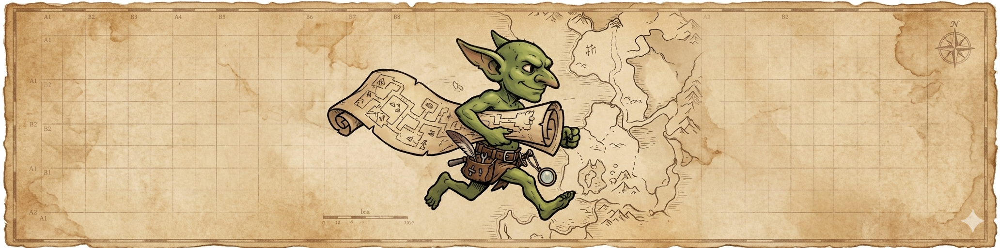

# Map-Goblin

> Who knows dungeon layouts better than a goblin?

**Map-Goblin** is a browser-based dungeon and battle-map editor built for
Dungeon Masters. Scrawl caverns, corridors, ruins, and wilderness maps
at goblin speed, then export or use them directly in your game — no install,
no nonsense, just maps.

---

## What the Goblin Can Do

### Scrawl the Dungeon
- **Rectangle, Polygon, Regular Polygon, Path** — full tool belt, snap-to-grid
- **Wall tool** — light-blocking walls with adjustable thickness
- **Erase mode** — carve holes through existing floors
- **Rough mode** — noise-roughened edges for organic caves and caverns
- **Auto-merge floors** — overlapping shapes fuse into one (Clipper2 WASM)

### Paint the Mood
- **Multi-layer dungeons** — stack and reorder with drag-and-drop
- **5 sublayers** — shadow, floor, grid, hatching, walls per layer
- **8 style presets** — one-click looks: from clean parchment to gritty stone
- **Per-layer colors** — floor, wall, shadow — all yours to tweak
- **Background layer** — solid fill, always at the bottom of the pile

### Light the Torches
- **Real-time point lights** — place, drag, tune each one
- **Wall-occluded shadows** — ClockwiseSweep visibility, no triangle artifacts
- **Falloff curves** — linear or quadratic radial fade
- **Bright zone slider** — set how much of the radius stays at full flame
- **Ambient darkness** — global color for the unlit void
- **Additive color mixing** — overlapping torches blend naturally

### Loot & Furnish
- **Built-in asset library** — browse and stamp prefab objects
- **Image import** — drag your own art onto the map
- **Persistent storage** — uploaded assets survive page reloads (IndexedDB)

### Select & Rearrange
- **Box-select** — drag to grab floor shapes
- **Copy / Paste / Cut** — clipboard with offset paste
- **Undo / Redo** — 100-step history, Command pattern

### The Goblin's Eye
- **Pan & zoom** — wheel, trackpad, pinch — smooth exponential
- **Retina / HiDPI** — sharp at any pixel density

### Stash & Share
- **Save / Load** — native `.mapbuilder` format (gzip JSON), Ctrl+S / Ctrl+O
- **Autosave** — 30-second IndexedDB backup, crash recovery
- **PNG / JPEG export** — configurable resolution

### The Workshop
- **Dark theme** — built for long sessions in dim taverns
- **Collapsible panels** — maximize your canvas when you need it
- **Keyboard shortcuts** — every tool, every action, one key away
- **Snap grid** — togglable overlay that scales with zoom

---

## Progress

`████████████████░░░░░░░░░░░░░░░░░░░░░░░░░░░░░░░░░░░░░░░░░░░░░░░░░░░░░░░░░░░░░░░░`
